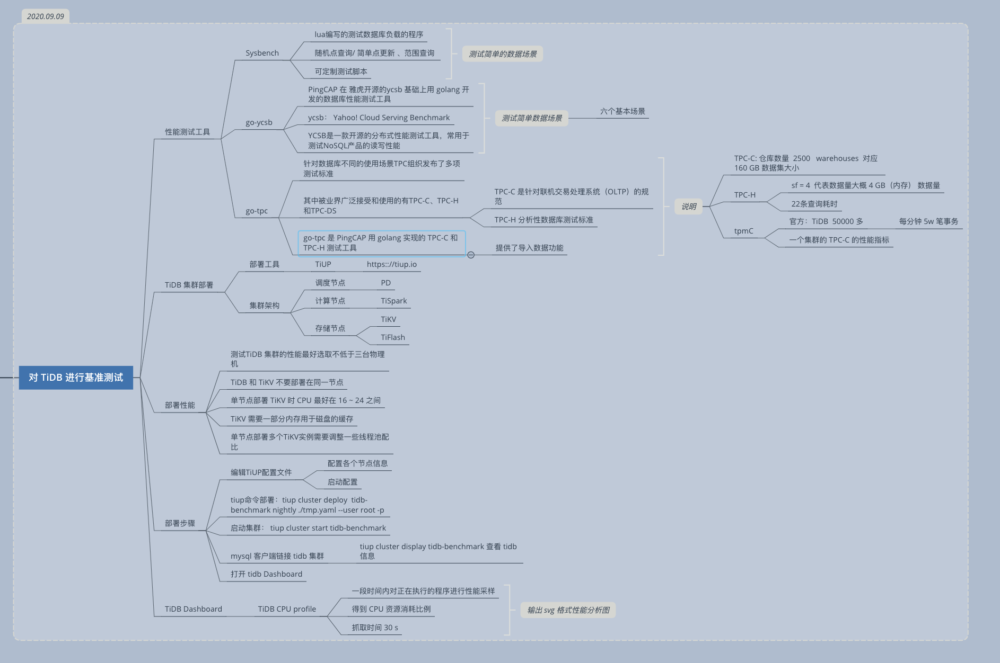

# 第二节课： TiDB 基准测试  

课程脑图：

### 参考资料：

- [使用 TiUP 部署 TiDB 集群](https://docs.pingcap.com/zh/tidb/stable/production-deployment-using-tiup)
- [Sysbench 基准性能测试](https://github.com/pingcap-incubator/tidb-in-action/blob/master/session4/chapter3/sysbench.md)
- [TPC-C 基准性能测试](https://github.com/pingcap-incubator/tidb-in-action/blob/master/session4/chapter3/tpc-c.md)
- [TiDB Dashboard 介绍](https://docs.pingcap.com/zh/tidb/stable/dashboard-intro)
- [ TiKV 线程池优化](https://github.com/pingcap-incubator/tidb-in-action/blob/master/session4/chapter8/threadpool-optimize.md)

### 学习心得

这节课程就是介绍 TiDB 集群部署的方法，以及如何对 TiDB 使用专用的测试工具进行性能测试，然后分析 Dashboard 中的数据来发现性能薄弱的地方，寻找可改进的空间。

### 作业简介

1. 使用 sysbench、go-ycsb 和 go-tbc 分别对 TiDB 进行测试并且产出测试报告

报告要求参考：https://docs.qq.com/sheet/DSlBwS3VCb01kTnZw?tab=BB08J2

说明： 

作业完成的条件比较高，暂时不做了。

1. 时间要求。
2. 硬件要求。

