# 第三节课： 通过工具寻找 TiDB 瓶颈

课程脑图：

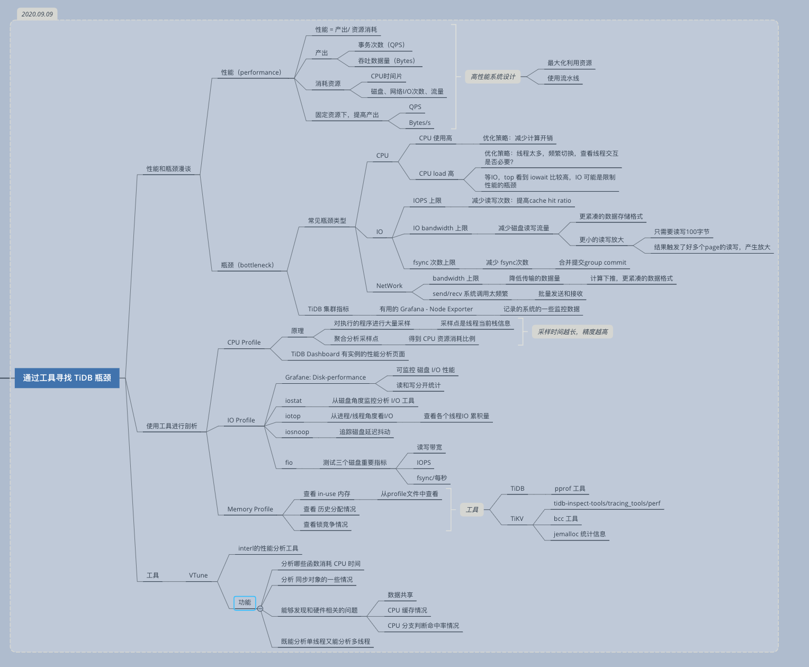

### 参考资料：

- [Golang pprof](https://docs.pingcap.com/zh/tidb/stable/production-deployment-using-tiup)
- [Linux Perf](http://www.brendangregg.com/perf.html)
- [ VTune Profiler](https://software.intel.com/content/www/us/en/develop/tools/vtune-profiler.html)

### 学习心得

本节课主要是要是：

1. 了解性能和瓶颈，知道一个好的高性能设计标准是什么。
2. 学习 profile 工具，并使用工具去发现 TiDB 或 TiKV 中的 Profile 瓶颈。

时间轴与对应资源消耗：

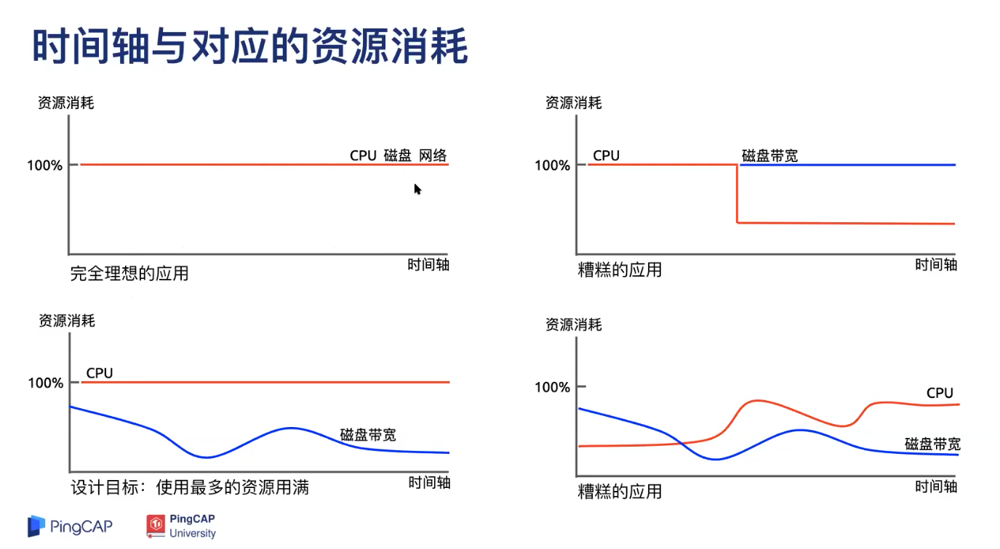

流水线：

1. 把大任务按阶段划分为小任务
2. 使用流水线技术减少任务总耗时

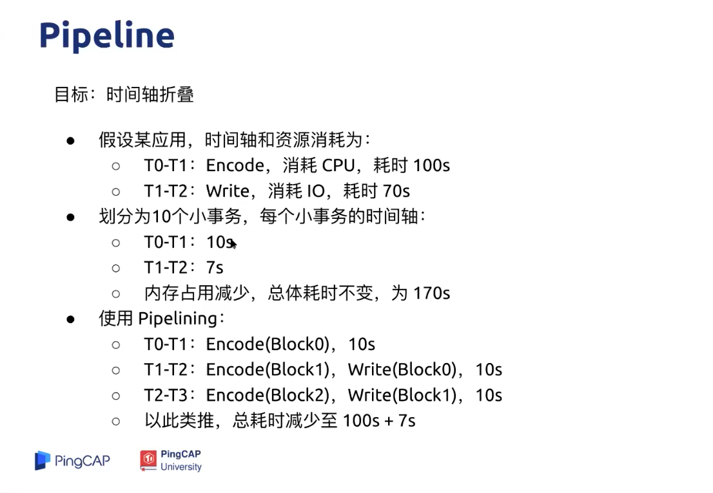

pipeline 效果是第二张图所示。

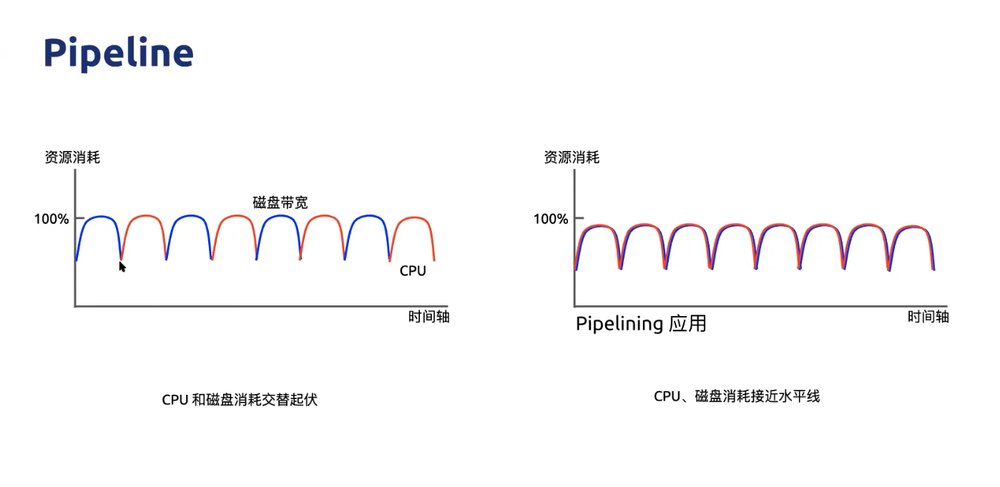

pipeline batch 划分要看场景：

1. 小粒度，延迟更好
2. 大粒度，吞吐性更好

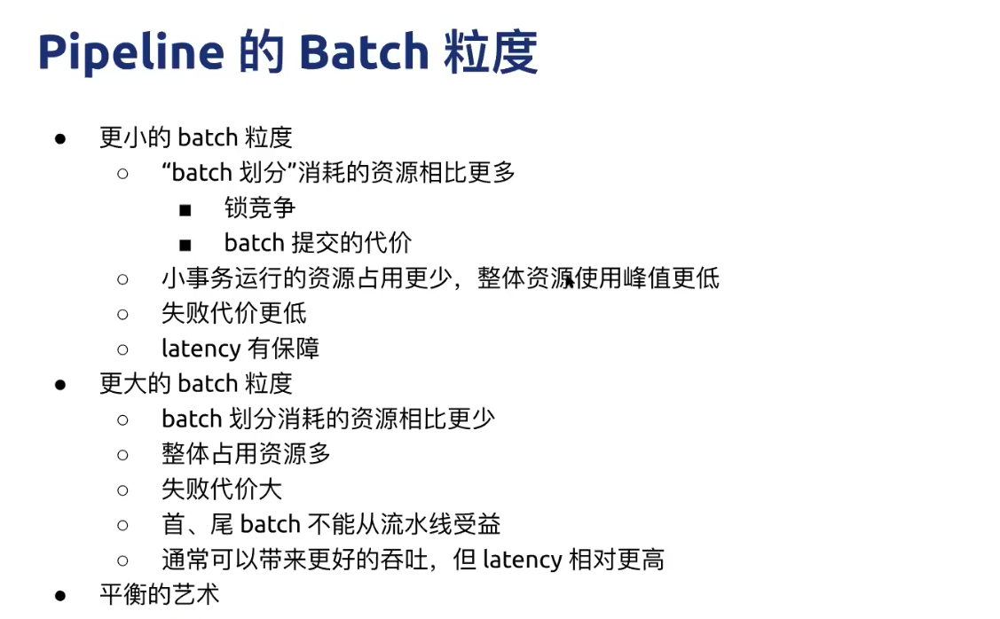
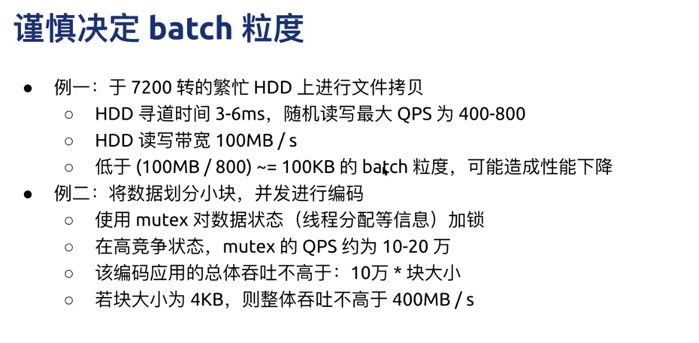

常见瓶颈类型：

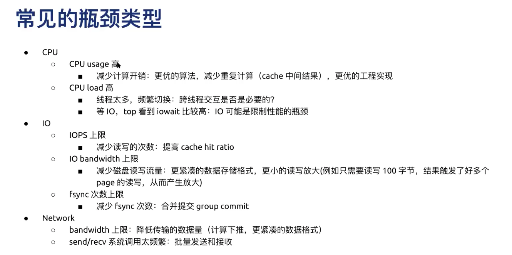

TiDB CPU 占用分析：

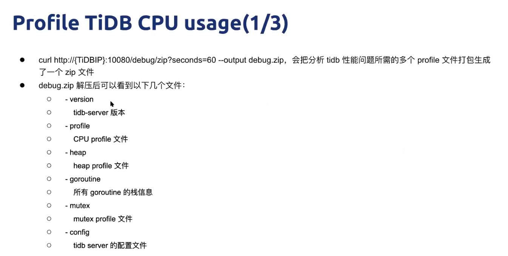
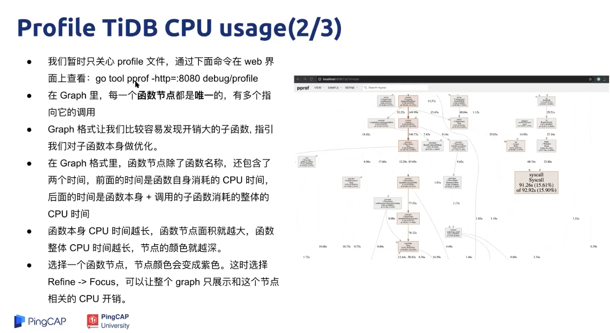

火焰图有助于阅读源码，因为栈调用关系比较明确：

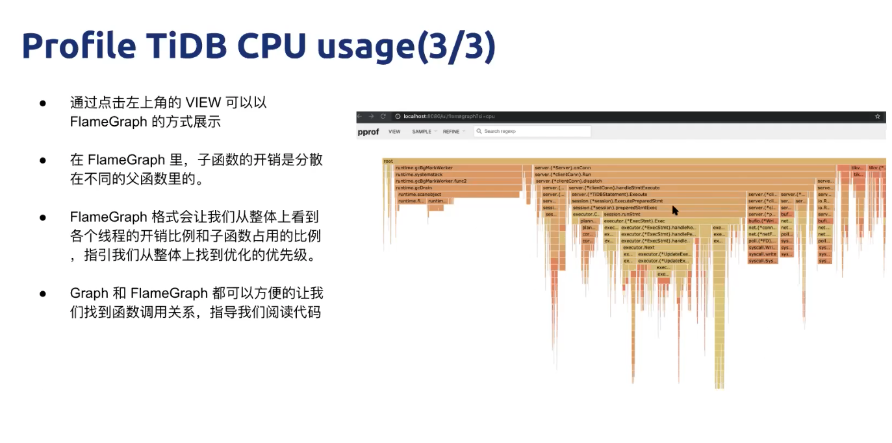

TiKV CPU 占用分析：

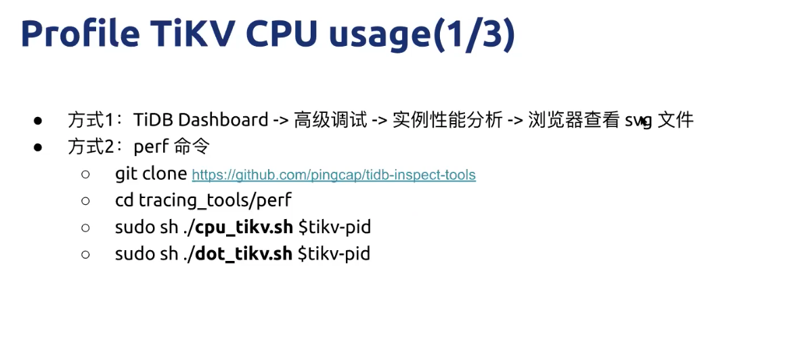

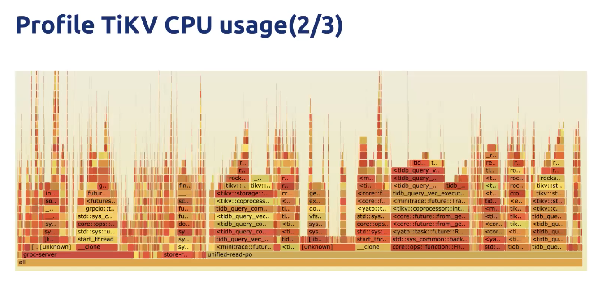

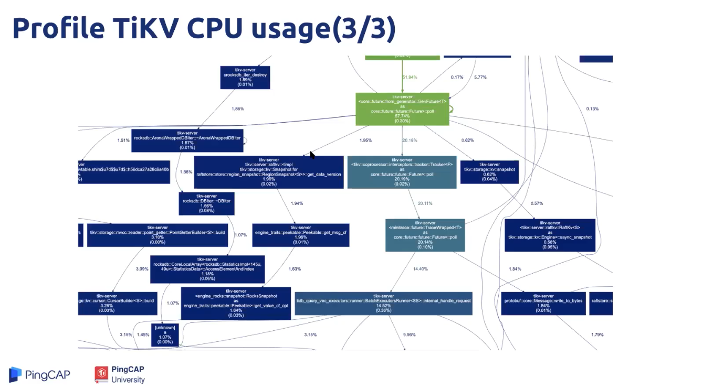

VTune 核心功能：

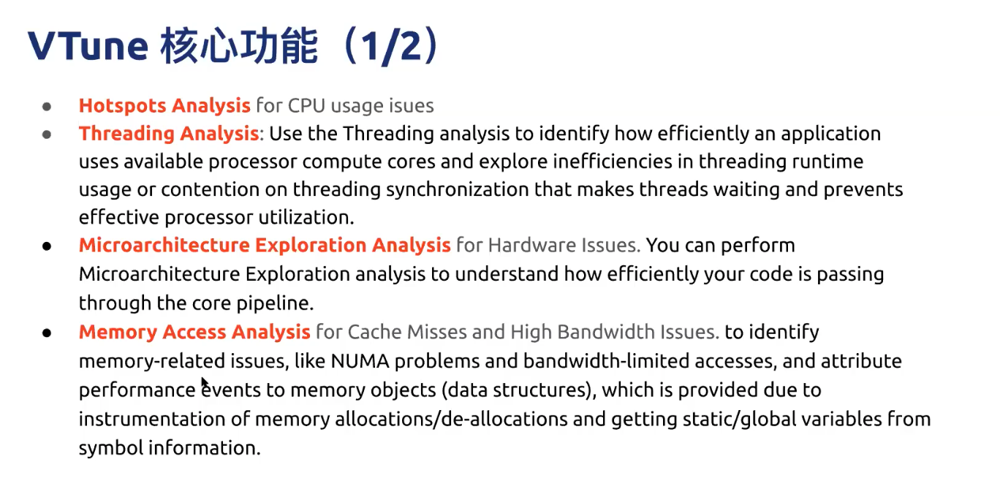

VTune 效果展示：

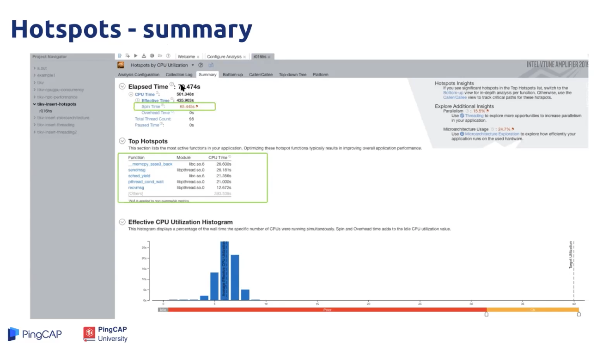
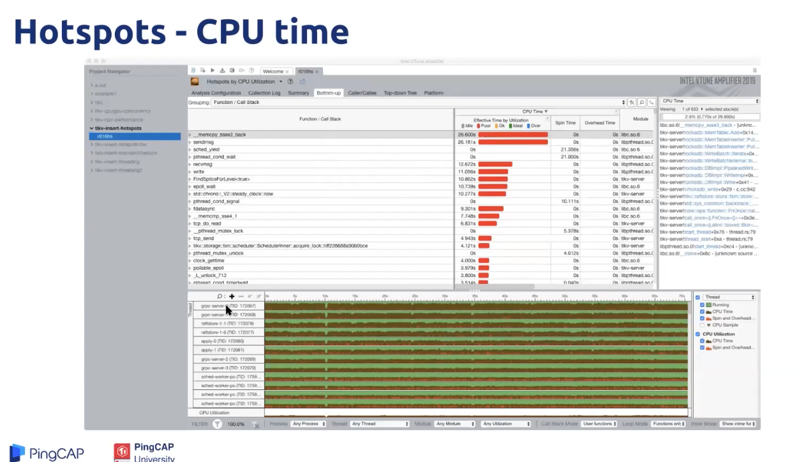
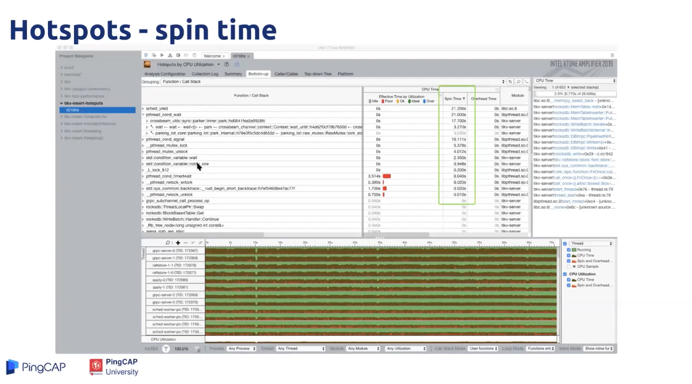

### 作业简介

1. 使用第二节介绍的工具对 TiDB 进行压测，然后使用本节介绍的工具对 TiDB 或  TiKV 进行 profile 分析，寻找潜在的可以优化的地方，并提出 enhance 类型的 issues 描述。

报告要求参考：https://docs.qq.com/sheet/DSlBwS3VCb01kTnZw?tab=BB08J2

说明： 

作业完成的条件比较高，暂时不做了。

1. 时间要求。
2. 硬件要求。

