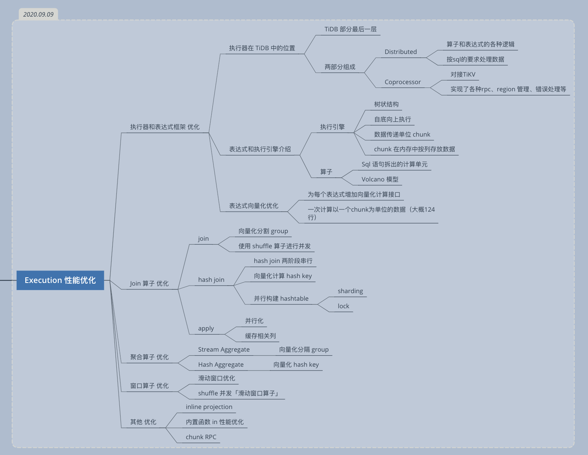

# 第四节课： Execution 性能优化

课程脑图：

### 参考资料：

- [TiDB 源码阅读系列文章（十）Chunk 和执行框架简介](https://pingcap.com/blog-cn/tidb-source-code-reading-10/)
- [TiDB 源码阅读系列文章（二十二）Hash Aggregation](https://pingcap.com/blog-cn/tidb-source-code-reading-22/)
- [TiDB 源码阅读系列文章（十五）Sort Merge Join](https://pingcap.com/blog-cn/tidb-source-code-reading-15/)
- [TiDB 源码阅读系列文章（九）Hash Join](https://pingcap.com/blog-cn/tidb-source-code-reading-9/)
- [ 向量化优化](https://docs.qq.com/pdf/DSkNaZW9hTXNqWXVH)

### 学习心得

本节课主要是介绍 SQL 执行器中各种表达式算子的优化。

优化方向：

1. 向量化优化
2. 并行优化

向量化优化：

 2017 年末开始，TiDB 走上了向量化执行引擎的道路，主要做了下面三个优化，取得了不错的性能提升：●一是将数据在 TiDB 内存中的布局，从行式改成了列式存储，见​PR/4856●二是将 Volcano 按行迭代的模型改成了按批（1024 行为一批）迭代，见​PR/5178●三是对部分算子的执行进行了一定程度的向量化优化，见​PR/5184完成优化后的 TiDB 2.0 版本和 TiDB 1.0 相比，大部分 TPC-H Query 的性能都有了数量级的提升，详细的性能对比测试可参考​TiDB TPC-H 50G Performance Test Report​。

- [img](../imgs/week4/vec1.png)
- [img](../imgs/week4/vec2.png)

Merge Join 优化

- [img](../imgs/week4/join1.png)
- [img](../imgs/week4/join2.png)

Hash Join 优化

- [img](../imgs/week4/hashjoin1.png)
- [img](../imgs/week4/hashjoin2.png)

NestedLoop Apply 优化

- [img](../imgs/week4/nestedloop_apply1.png)
- [img](../imgs/week4/nestedloop_apply2.png)
- [img](../imgs/week4/nestedloop_apply3.png)
- [img](../imgs/week4/nestedloop_apply4.png)

Stream Aggregate 优化

- [img](../imgs/week4/stream1.png)

Hash Aggregate 优化

- [img](../imgs/week4/hash1.png)

滑动窗口优化

- [img](../imgs/week4/sliding1.png)
- [img](../imgs/week4/sliding2.png)
- [img](../imgs/week4/sliding3.png)

inline projection

- [img](../imgs/week4/inline.png)

内置函数 in 性能优化

- [img](../imgs/week4/in.png)
- [img](../imgs/week4/in2.png)

chunk RPC

- [img](../imgs/week4/chunk.png)
- [img](../imgs/week4/chunk2.png)

### 作业简介

1. 认领一个还未进行滑动窗口优化的聚合函数，并根据issues内描述它的内存追踪，并优化它

报告要求参考：https://docs.qq.com/sheet/DSlBwS3VCb01kTnZw?tab=BB08J2

说明： 

作业完成的条件比较高，暂时不做了。

1. 时间要求。
2. 硬件要求。

