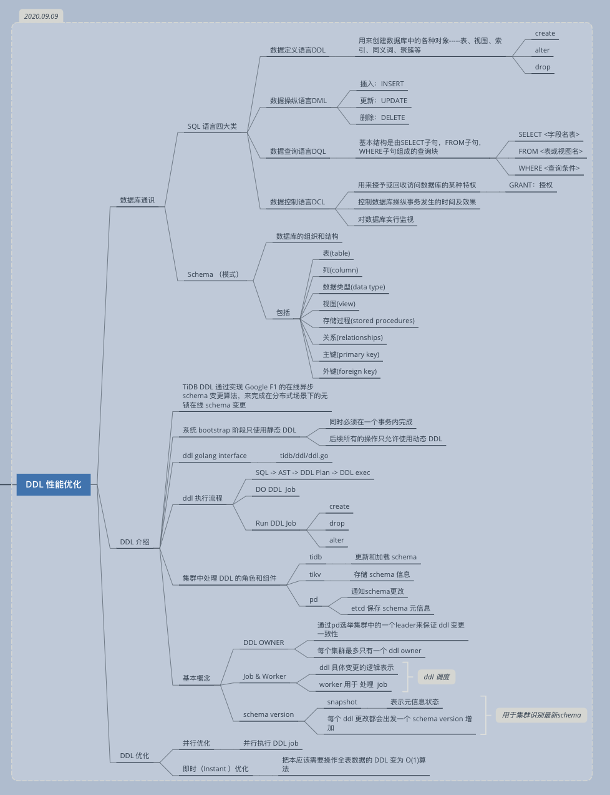
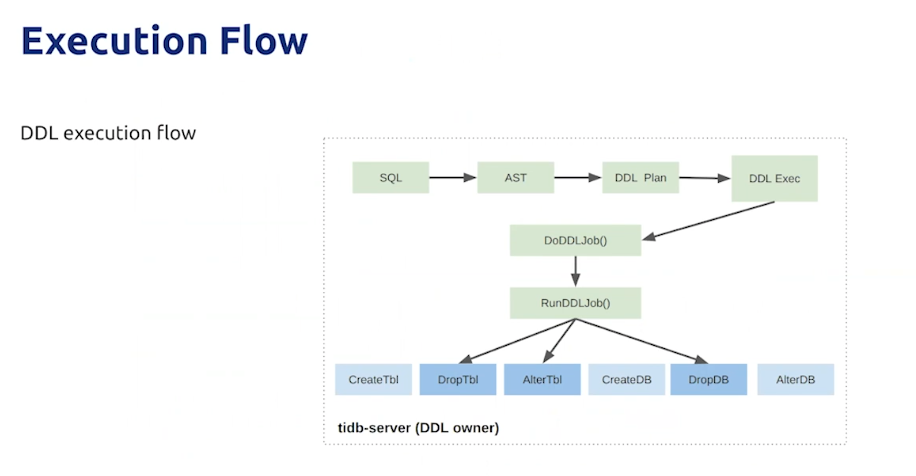
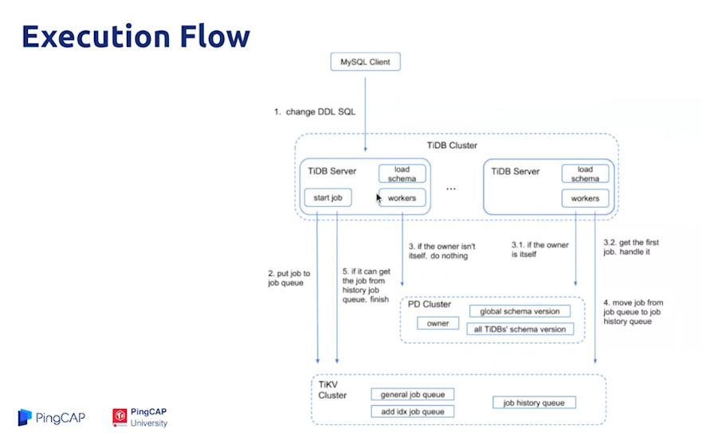
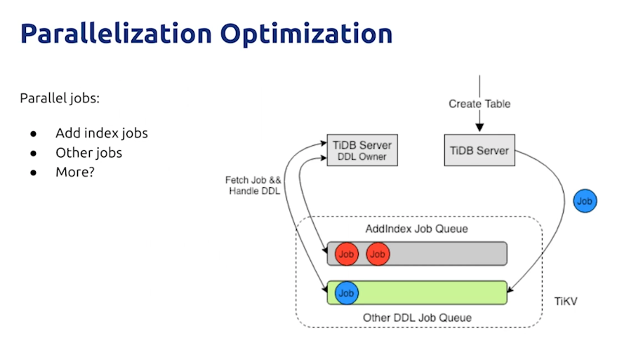
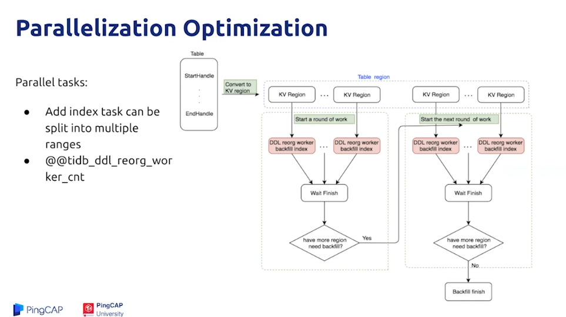
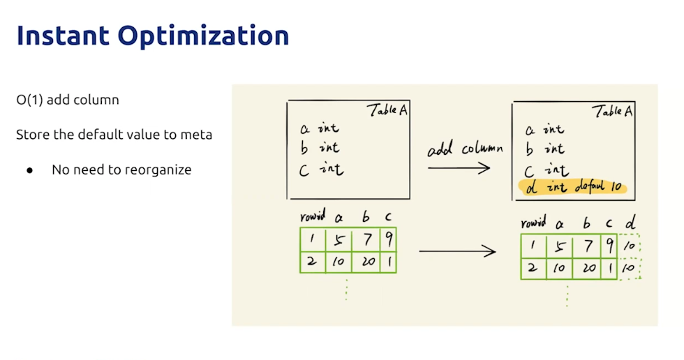
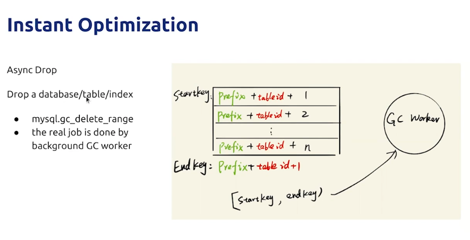

# 第五节课： DDL 性能优化  

课程脑图：

### 参考资料：

- [TiDB 源码阅读系列文章（十七）DDL 源码解析](https://zhuanlan.zhihu.com/p/43088324)
- [Sysbench 基准性能测试](https://github.com/pingcap-incubator/tidb-in-action/blob/master/session4/chapter3/sysbench.md)
- [TPC-C 基准性能测试](https://github.com/pingcap-incubator/tidb-in-action/blob/master/session4/chapter3/tpc-c.md)
- [TiDB Dashboard 介绍](https://docs.pingcap.com/zh/tidb/stable/dashboard-intro)
- [ TiKV 线程池优化](https://github.com/pingcap-incubator/tidb-in-action/blob/master/session4/chapter8/threadpool-optimize.md)

### 学习心得

1. 了解了 DDL 的执行流程。
2. 了解到 目前 DDL 的优化方向：并行化 DDL Job ，以及优化 DDL 操作全表数据操作的一些算法

DDL 执行流程：

并行优化：

即时（instant）优化：

### 作业简介

1. 在 TiDB 项目中查找：` GitHub Issue:is:open label:high-performance sig/ddl `

报告要求参考：https://docs.qq.com/sheet/DSlBwS3VCb01kTnZw?tab=BB08J2

说明： 

作业完成的条件比较高，暂时不做了。

1. 时间要求。
2. 硬件要求。

